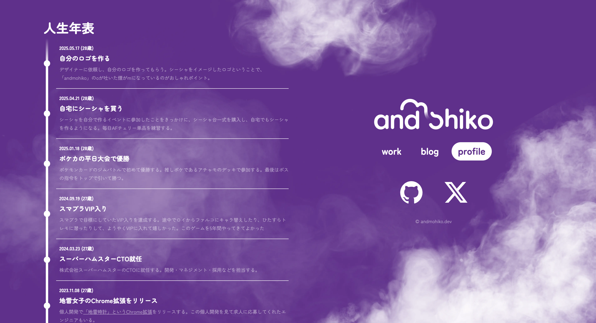
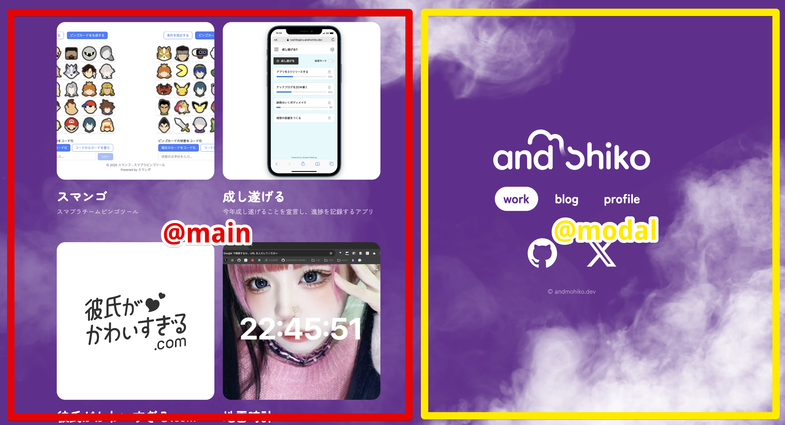
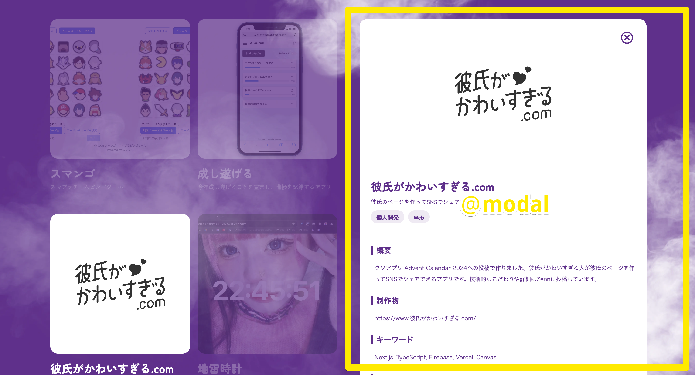

## はじめに

6年間運用していたポートフォリオサイトをリニューアルしました。学生時代から継続的に更新してきたサイトでしたが、今回デザインも作り直し、技術スタックも大幅に変更しました。今回はリニューアルの背景や技術選択について書いてみたいと思います。

## 学生の頃に作ったサイトを6年間更新していた

最初にこのポートフォリオサイトを作ったのは学生時代のことでした。フロントエンドの勉強として、当時はモダンだったNuxt.jsの2系でサイトを構築しました。シンプルなデザインでしたが、初めてサイトを作った達成感がありました。


その後エンジニアとしてキャリアを積む中で、技術的な学習も兼ねてAstroにリプレイスしました。Astroのアイランドアーキテクチャや高速なビルド、必要最小限のJavaScriptという特徴を実際に体験でき、こちらも勉強になりました。

6年間同じサイトを継続的に更新し続けてきました。新しいプロジェクトを追加したり、技術ブログを書いたり、デザインを少しずつ調整したりと、愛情を込めて育てました。

## サイトの内容

リニューアル後のサイトでは、以下のコンテンツを用意しています：

- [ブログ(/blogs)](/blogs)：技術記事やプロジェクトの振り返りなど
- [ポートフォリオ(/)](/)：これまでに取り組んだプロジェクトの詳細
- [About(/profile)](/profile)：自己紹介や現在の取り組みについて
- [人生年表(/profile)](/profile#timeline)：エンジニアとしてのキャリアや重要なマイルストーン

特に人生年表は今回新しく追加したコンテンツで、AIと対話する際に、自分の文脈がインターネット上に公開されている方がAIの回答の精度が上がると思い、追加しました。



## 技術スタック

今回のリニューアルでは、AstroからNext.jsにリプレイスしました。

Astroは開発体験もよく、パフォーマンス面では非常に優秀でした。しかし、新しいデザインでより柔軟なルーティングが必要になったことと、Next.jsの最新機能を学習したかったため、リプレイスすることにしました。

## こだわり

今回のリニューアルで特にこだわったのは、Next.jsの[Parallel Routes](https://nextjs.org/docs/app/api-reference/file-conventions/parallel-routes)と[Intercepting Routes](https://nextjs.org/docs/app/api-reference/file-conventions/intercepting-routes)を活用したユーザー体験の向上とSEO対策です。これらの機能はNext.js 13のApp Routerで導入された機能です。

Parallel Routesを使うことで、動的なページコンテンツと全ページ共通のナビゲーションを同時に表示できるようになりました。また、Intercepting Routesを活用することで、ユーザーとしてはモーダルを開いているだけという体験のまま、URL的にはページ遷移しているという挙動を実現しました。

### Parallel Routesの使いどころ

Parallel Routesは、同一レイアウト内で複数のページを同時に、または条件に応じてレンダリングできる機能です。名前付きスロット（`@folder`記法）を使用してルートを定義し、それらのスロットが親レイアウトにプロパティとして渡されます。重要な点として、スロットはURLの構造に影響を与えません。

本サイトでは2カラムのデザインになっており、2つのスロットに分かれています。画面左側が`@main`スロット、右側が`@modal`スロットになっています。

```
src
└── app
    ├── @main/
    │   └── page.tsx
    ├── @modal/
    │   └── page.tsx
    ├── layout.tsx
    └── page.tsx
```

コンテンツをなにも選択していないときは画面右側は`layout.tsx`に記述されている画面共通のナビゲーションが表示されます。


コンテンツを選択したときは右側にモーダルが表示され、モーダル内にコンテンツが表示されます。


このとき、ユーザー体験としてはモーダルを表示しただけであり、画面遷移したようには感じません。しかし、実際にはURLは書き換わっており、SEO的にも別ページとして扱われます。
Parallel Routesを使うことで、ユーザー体験とSEO対策を両立できました。

しかし、Parallel Routesだけだと、コンテンツ詳細ページに直接アクセスすると`@main`スロットと`@modal`スロットが期待通りに動作しません。そこで、URLから直接アクセスした際にはコンテンツ専用ページとして完全な情報を表示できるようにする仕組みも必要になります。
この仕組みを実現するためにIntercepting Routesを使用しました。

### Intercepting Routesの使いどころ

Intercepting Routesとは、現在のレイアウト内で別の場所からルートを読み込み、ユーザーが異なるコンテキストに切り替えることなくコンテンツを表示できる機能です。`(.)`や`(..)`などの記法を使用してルートを定義し、クライアントサイドナビゲーション時とダイレクトアクセス時で異なる表示方法を実現できます。

例えば`/blogs/hoge`にアクセスした際に、本来では`app/blogs/[slug]/page.tsx`が呼び出されてブログ記事の専用ページが表示されます。しかし、Intercepting Routesにより`app/@modal/(.)blogs/[slug]/page.tsx`が割り込んで呼び出されます。これにより、Parallel Routesで定義したモーダルが表示されます。

Parallel RoutesとIntercepting Routesを組み合わせることで2つの体験を同じURLで実現できます:

- サイト内ナビゲーション: モーダルでスムーズな閲覧体験
- 直接アクセス: 完全な情報を含む専用ページでSEO対策とアクセシビリティを確保

URLを共有してもらったり検索エンジンから流入したときには適切な専用ページが表示される一方で、サイト内での閲覧時にはコンテキストを失わない快適な体験を提供できます。

## さいごに

デザイン面も実装面も満足のいくものが作れました。自分で見返したくなるサイトを作れてうれしいです。

エンジニアとして成長する中で、自分のポートフォリオサイトは技術的な実験場にもなっており、今回のリニューアルで得られた技術的な知見は、今後の業務でも活かしていきたいと思います。
