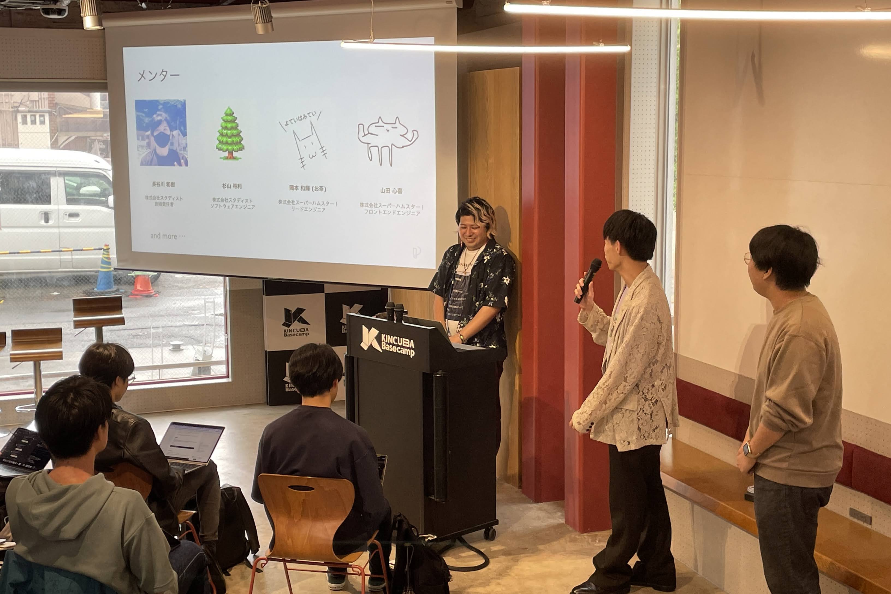
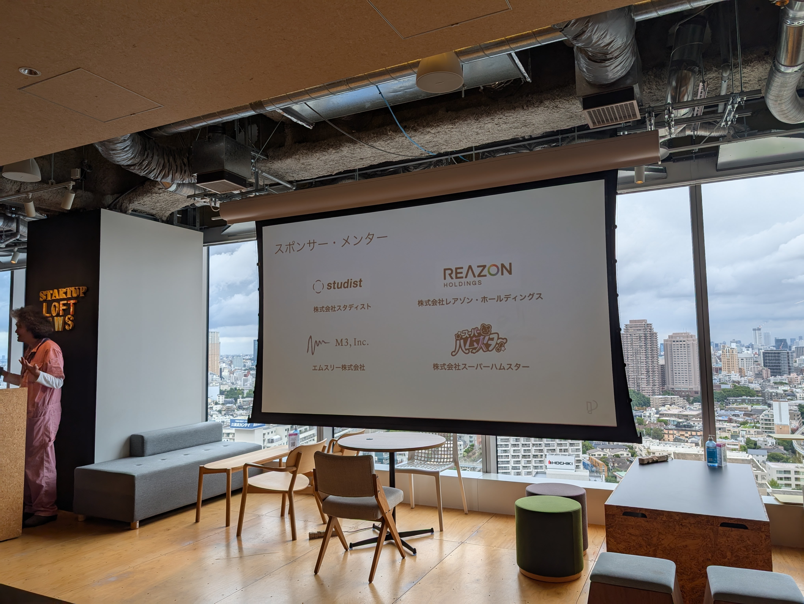
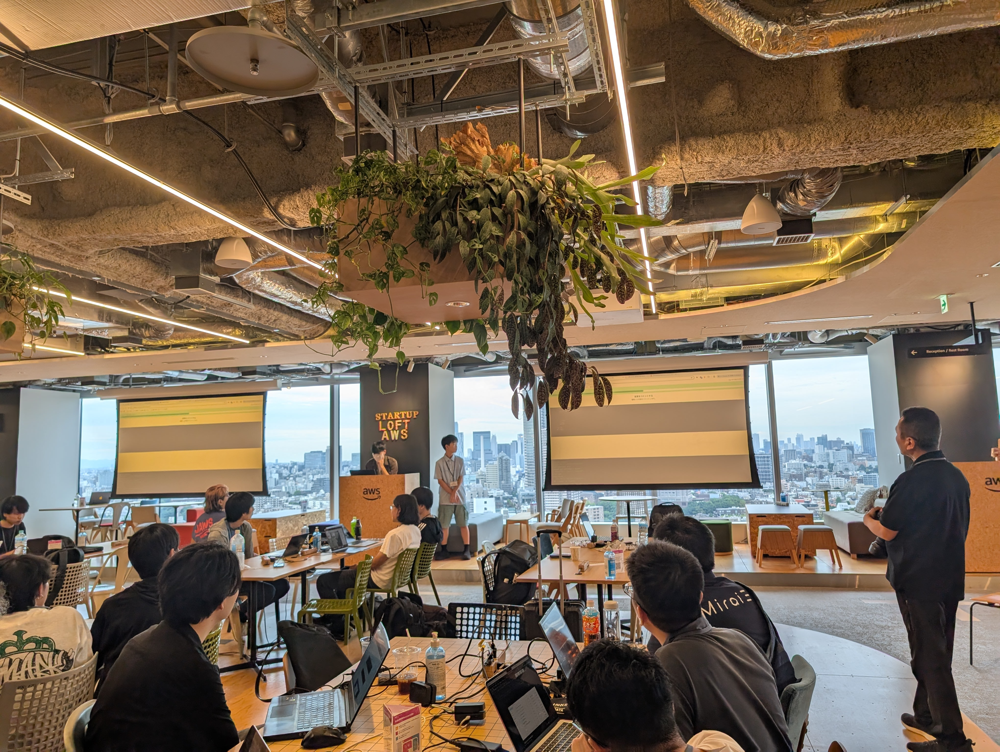
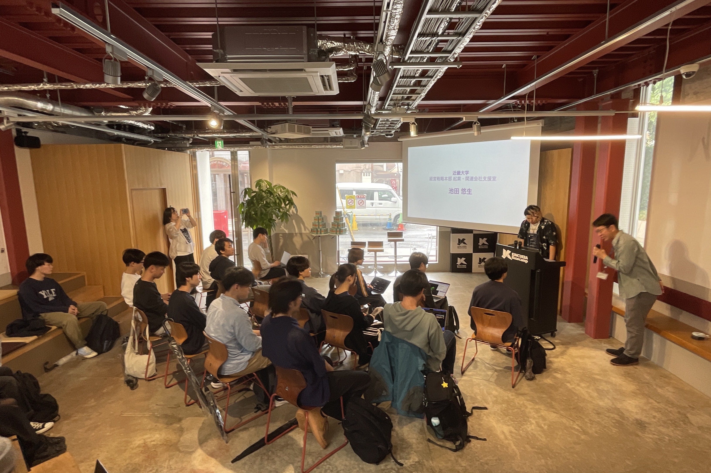
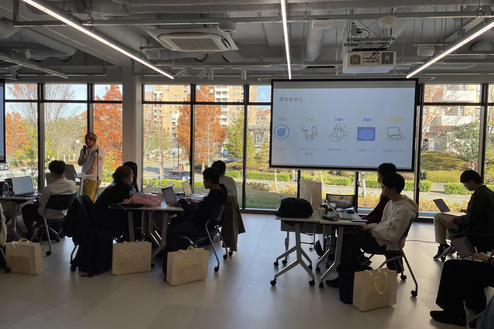
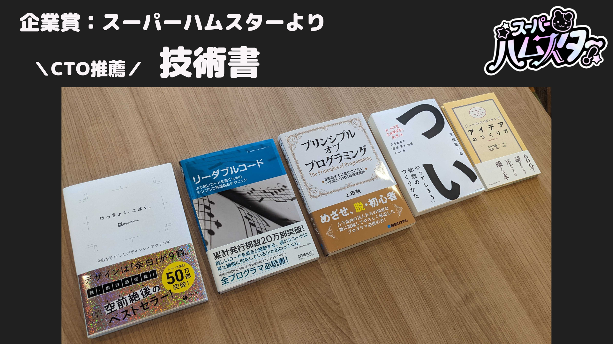
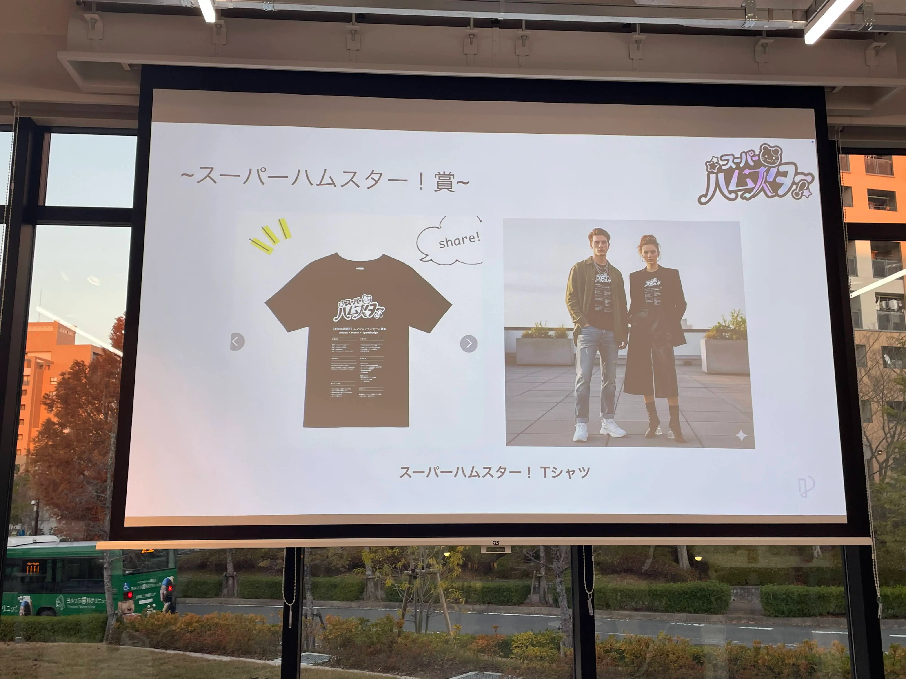

この記事は[Progate Path コミュニティ Advent Calendar 2025](https://qiita.com/advent-calendar/2025/progate-path)の14日目の記事です。

## はじめに

株式会社スーパーハムスター！では学生の採用と育成に力を注いでいます。2025年は、その一環としてProgateのハッカソンに企業メンターとして何度か参加させていただきました。

参加してみると、優秀で熱量の高い学生とたくさん出会うことができ、メンターとして参加できてよかったと感じています。そこで、同じように学生の採用や育成に関心のある企業エンジニアの方々にも、ハッカソンへのメンター参加をおすすめしたいと思い、この記事を書くことにしました。

この記事では、実際にメンターとして参加した経験を踏まえ、参加して良かったことや、参加を検討している方へのメッセージを書きました。

## ハッカソンメンターとは

学生向けのハッカソンに企業エンジニアがメンターとして参加することができます。弊社がメンターとして参加したハッカソンは2日間の開催で、リモートでキックオフしてから開発することができ、最後の2日間で現地で開発します。

メンターは、ハッカソンに参加している学生チームに対して技術的なアドバイスをしたり、開発の進め方について相談に乗ったりする役割を担います。しかし、実際は学生が優秀すぎるあまり、メンターにラバーダッキングしているだけで解決できたり、黙々と進めるチームも多く、メンターは話を聞くのがメインになったりもします。

## 2025年の参加経験

弊社では、[Progate](https://path.progate.com/)と[ハックツハッカソン](https://cup.hackz.team/)が開催するハッカソンに合計5回メンターとして参加させていただきました。（以下企業名敬称略）

実際の参加レポートは[こちら](https://andmohiko.dev/blogs/58hackathon2025)に詳しく書いています。

東京で開催されたハッカソンは筆者が参加し、関西で開催された会は弊社の関西メンバーがメンターとして参加しました。メンターは複数人で参加することができるので、普段会わないメンバーとオフラインで集まる機会にもなり、単純に社内のイベントとしてもうれしいです。

スーパーハムスターでは毎回企業賞を用意させていただいており、過去には技術書や会社のTシャツ、とらやの羊羹のときもありました。

## メンター参加して良かったこと

### 優秀な学生との出会い

何度も参加している学生は数か月ぶりに話すと技術的にレベルアップしていたり、前回のハッカソンで課題だった部分を克服してきていたりと、学生の成長スピードを感じることができて楽しいです。
また、ハッカソンに参加している学生は技術に対する熱量が高く、チャレンジングな技術スタックに挑戦している様子を見ることができ、自身の技術へのモチベーションも刺激されます。

58ハッカソンの審査基準はデモや技術的な観点の配点が高いため、学生たちの技術力をより感じることができます。

### 企業の採用活動への貢献

メンターとして参加することで、学生に直接弊社のことを知ってもらう機会になります。実際に、ハッカソンで出会った学生が弊社のインターンに応募してくれたり、その後入社してくれたりするケースもあります。
また、企業賞を用意することで、学生に弊社の名前を覚えてもらう機会にもなります。採用活動という観点では、ハッカソンへのメンター参加は、学生との接点を作る良い機会になっています。

### コミュニティへの貢献

ハッカソンは、学生が技術を学び、実践する場です。メンターとして参加することで、学生の学習と成長をサポートし、エンジニアコミュニティ全体の発展に貢献することができます。
自分は学生時代に先輩エンジニアからたくさんのものをもらったので、今度は自分が次の世代に返していく番だと思っています。社会人として学生エンジニアコミュニティになにかできることがあれば、長期的なコミュニティへの貢献にも繋がると思っています。

## 参加を検討している企業エンジニアの方へ

### 参加のハードルは低い

メンターとして参加するハードルは、思っているよりも低いです。学生の相談に乗ったり技術的な質問に答えたりするため、メンター側で事前に準備することや特別なインプットはあまり必要ありません。

また、メンターは複数人で参加することができますし、全日程参加できなくても他のメンバーとバトンタッチすることもできます。

### 必要なスキルや準備

メンターとして参加する上で、特別に必要なスキルはありません。

事前に準備しておくこととしては、企業賞を用意することをおすすめします。過去の開催では企業のノベルティや食事権などを企業賞として提供しているのを見かけました。
弊社からは技術書やノベルティのTシャツを渡したり、とらやの羊羹をお贈りしたこともあります。

## さいごに

2025年はProgateのハッカソンにメンターとして参加させていただき、優秀で熱量の高い学生とたくさん出会うことができました。メンターとして参加することで、学生の成長をサポートし、採用活動にもつながり、さらにコミュニティ全体にも貢献できる機会だと感じました。

メンターとして参加するハードルは思っているよりも低く、特別な準備やスキルは必要ありません。学生の相談に乗ったり、技術的な質問に答えたりするだけで、十分にメンターとしてハッカソンを盛り上げることができます。

学生の採用や育成に関心のある企業エンジニアの方々には、ぜひハッカソンへのメンター参加を検討していただき、学生エンジニアが楽しめる場を一緒につくれればと思います。
