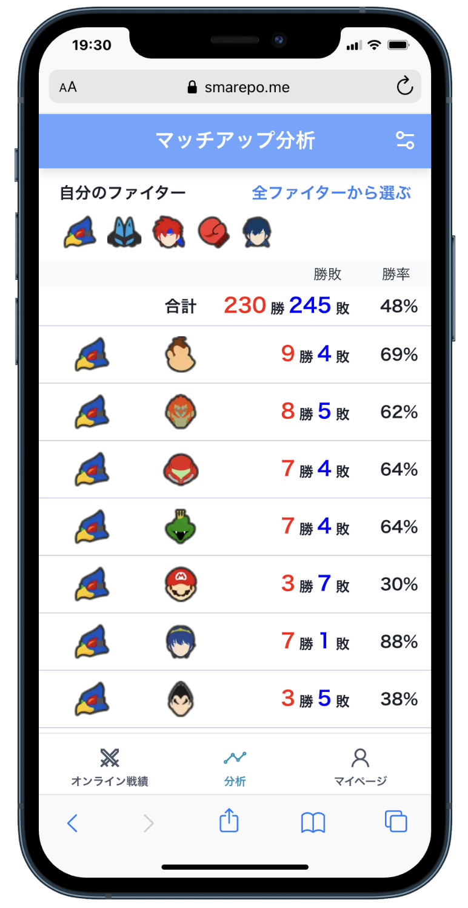
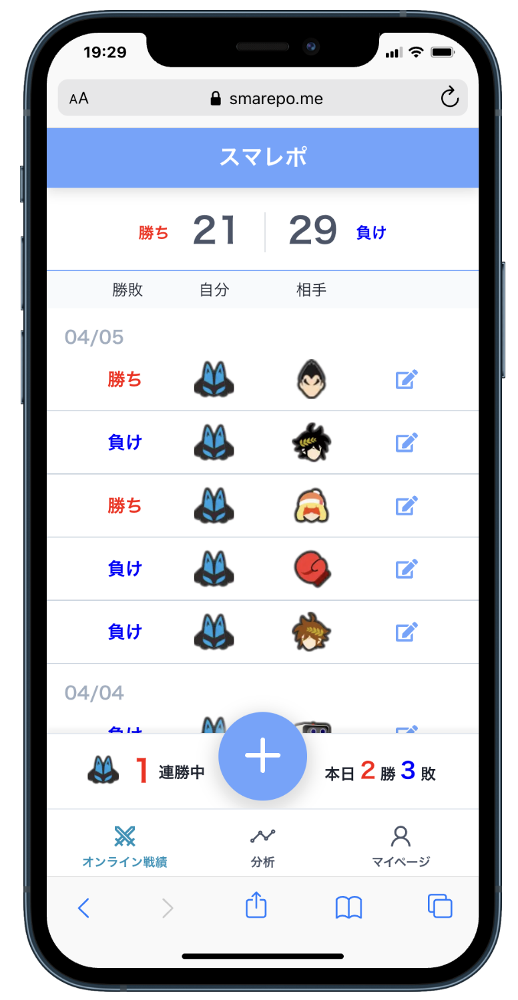
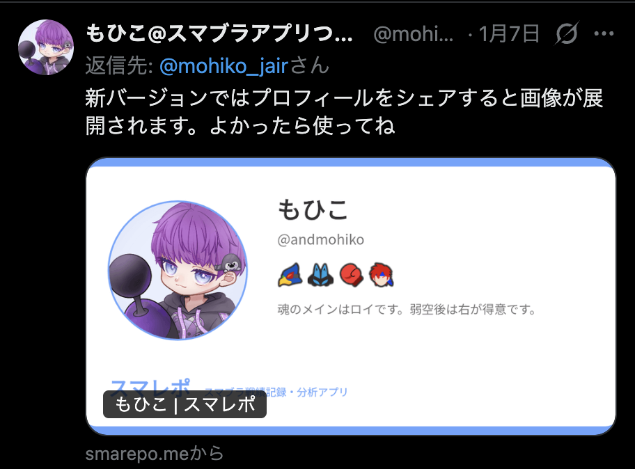
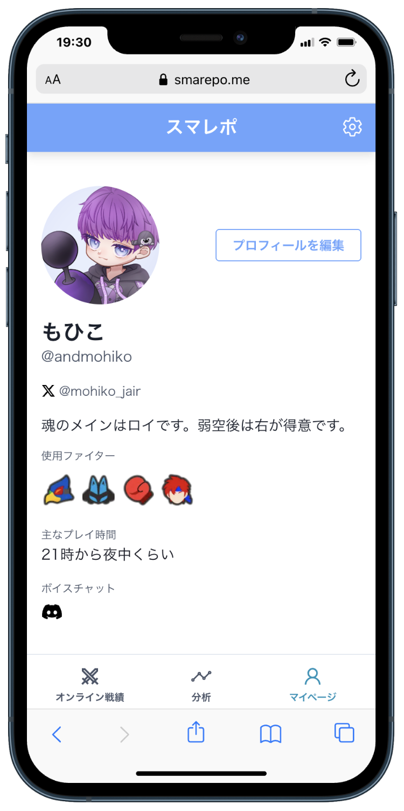

## はじめに

2021年にリリースした「スマレポ」という個人開発のアプリを、5年越しにリニューアルしました。当時の技術スタックが古くなり、メンテナンスできない状態になっていたため、現代の技術スタックでフルリプレイスしています。

この記事では、リニューアルの進め方や、過去に作った個人開発をどう維持していくかについて書きました。

## スマレポとは

スマレポは、大乱闘スマッシュブラザーズ（スマブラ）のオンライン対戦の戦績を記録・分析できるWebアプリです。5年前の今日（2021/01/10）にリリースしました。詳しくは [スマブラが上手くなりたすぎてアプリを作りました](https://andmohiko.dev/blogs/20210131) という記事に書いています。

学生時代に作った個人開発で、自分にとっては初めて多くのユーザーがついたアプリです。リリース初日で500ユーザーを突破し、最終的には1000人弱のユーザーが使ってくれていました。自分にとっては思い入れのある個人開発です。

## リニューアルのモチベーション

このアプリを作った当時、自分はWebエンジニアとしてはまだ経験が浅く、とんでもない作り方をしていました。メンテナンスしづらいコードで、ライブラリの更新なども行なっておらず、もはやローカルで起動すらできなくなっていました。

Nuxt.jsは2系で書いたまま更新しておらず、TypeScriptもまともに書けないのでJavaScriptで書いており、状態管理やDB設計もわからず、今思うとなぜこんな設計にしたんだろうと思うことばかりです。

今でもスマブラはするため、またこのアプリを使いたいと思い、今の自分が使いたいと思えるアプリとして作り直しました。

## リニューアル前後の技術スタック

リニューアル前後の技術スタックは以下の通りです。

|  | リニューアル前 | リニューアル後 |
| --- | --- | --- |
| フレームワーク | Nuxt.js | Next.js |
| 言語 | JavaScript | TypeScript |
| スタイリング | Tailwind CSS | CSS Modules |
| コンポーネントライブラリ | - | Mantine |
| 状態管理 | Vuex | Context API |
| 認証 | Firebase Authentication | Firebase Authentication |
| データベース | Firestore | Firestore |
| サーバーサイド | - | Cloud Functions |
| インフラ | Firebase Hosting | Vercel |

気持ちが切れる前に作り終わりたかったため、最速で作れる技術スタックにしました。また、DB設計を見直し、非正規化したデータの整合性をとるため、Cloud FunctionsのFirestoreトリガーを使うようにしました。

## リニューアルの進め方

作り直すにあたり、まずはアプリのコンセプトの再確認から行いました。アップデートを繰り返すうちに機能が増えていっていましたが、使わない機能も多くなっていました。今回は初心に帰り、オンライン対戦の戦績を記録することに集中し、機能を削ることにしました。

当時のDB設計はNoSQLの非正規化などもわかっておらず、すべてをクライアントサイドで処理する設計になっていました。今回はCloud Functionsを組み合わせることで、非正規化したデータの整合性をとることを前提にしたDB設計にしました。これに伴い、既存データのマイグレーションは諦め、既存のデータはすべて削除することにしました。今まで使ってくれてた方はゴメンナサイ。

フレームワークを移行するフルリプレイスになり、デザインも見直しました。当時は広告を入れることも見据えたデザインにしていましたが、今回は邪念を捨てています。

## こだわったこと

### DB設計

分析機能では、従来は戦績を全件取得し、クライアント側で集計していました。この方法だとreadが多くなり、インフラ費も上がりますし、データ量が多くなるほどアプリが重くなってしまいます。

今回は戦績の集計コレクションを追加し、分析画面ではそのコレクションを取得するだけで済むようにしました。戦績追加・編集時にCloud FunctionsのFirestoreトリガー関数が発火し、集計コレクションに非正規化したデータを更新するようにしました。

### パフォーマンス

戦績一覧画面で今までは全件取得していたため、アプリを使うほどアプリが重くなっていきました。今回は50件ずつページネーションし、無限スクロールでデータをフェッチするようにしました。これにより、アプリの初期描画も速くなり、アプリの使用感も軽くなりました。

### 新機能

地味な新機能として、プロフィール画面をXでシェアするとOGP画像が表示されるようにしました。プロフィールが更新されるとCloud FunctionsでOGP画像が動的に生成されます。2025年の資産である[動的なOGP画像の生成術](https://zenn.dev/andmohiko/articles/7047b9caa7d471)を使い回しました。

プロフィール画像の設定で、画像のトリミング機能を追加しました。こちらも[過去の資産](https://zenn.dev/andmohiko/articles/d70d9264a6fbf7)を使いました。

## 過去に作った個人開発を維持していく

個人開発で作ったアプリを運営し続けることは意外とむずかしいことだと思います。個人開発は作ったら終わりなことが多く、放置していると気づかないうちに動かなくなっていることもあります。かといってメンテナンスの手間をかけられる時間も熱量も残っていないかもしれません。なにより、過去の成果物が恥ずかしくなって、非公開にしてしまうこともあるでしょう。

愛着を持てるプロダクトを愛で続けることは楽しいですが、自分が熱量を持ち続けられる成果物を毎回作れるとは限りません。

過去に作った個人開発を維持するには、まずは自分が本当に使いたいと思うアプリを作ることから始めるのが良いと思います。そのアプリのユーザーが世界で自分しかいなかったとしても、自分が欲しいものを作り続けることが大事だと思いました。

## さいごに

学生時代に作ったアプリを5年越しにリニューアルしました。当時の自分のコードを見ると恥ずかしくなりますが、あのとき勢いで作ってリリースした経験があったからこそ今の自分があると思います。

個人開発をメンテナンスし続けることは、自分の考え方やスキル感の時間変化をスナップショット的に見返すことができるのでおもしろいです。

自分が愛で続けたいと思える個人開発をこれからも作っていきたいです。
