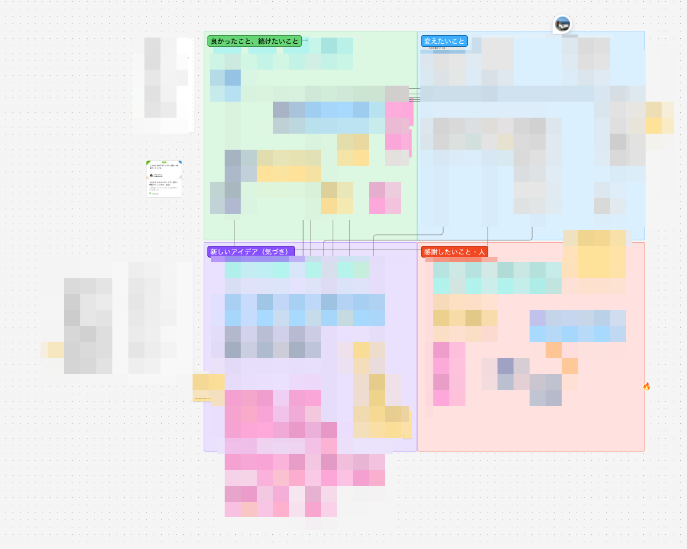

## はじめに

弊社では受託開発も行なっていますが、副業メンバーだけで開発しているプロジェクトもあります。受託開発ではフェーズで区切って開発していますが、今フェーズの開発が完了し一区切りついたタイミングで、チームで振り返りを実施しました。

特にスタートアップでは副業メンバーのみで構成されている開発案件もあると思います。副業チームだとどうしても振り返りの機会を設けずに進んでしまうことが多いと思いますが、この記事では、副業チームでも振り返りをするべきか、どう振り返るべきかについて書きました。

## プロジェクトの体制

開発チームはPM1名（私）、デザイナー1名、エンジニア4名の計6名で、私を除き、みな副業で参加しているメンバーです。各メンバーの稼働は週16時間程度で、PMの自分は複数の受託案件を並行しているため、このプロジェクトにフルコミットしているわけではありません。

今フェーズの開発期間は3ヶ月間で、これまで作ってきたアプリケーションに大きな新機能を2つ載せることが主要な開発アイテムでした。エンジニア2名がそれぞれ1機能ずつ担当し、残りの2名は不具合修正などを対応する体制で進めていました。

## なぜ振り返りをしようと思ったか

前フェーズでは課題が多かったのですが、振り返りをできておらず、課題の洗い出しや対策をしないまま次に進んでしまいました。その結果、今フェーズの序盤では前フェーズの課題を引きずっており、開発を進めていく中で解決していきました。
今回は次フェーズに向けてさらに良いチームにしていきたいという思いもあり、今フェーズの完了時にしっかり振り返りの場を設けました。

## 振り返りの手法: 学習マトリックス

今回の振り返りでは「学習マトリックス」という手法を採用しました。メンバーのひとりが本業で実践していた手法で、チームに提案してくれたものです。

学習マトリックスでは、以下の4つの観点で振り返りを行います。

- 良かったこと・続けたいこと: KPTでいうKeep
- 新しいアイデア・気づき: KPTのProblemよりは少し広げた感じ
- 変えたいこと: 新しいアイデア・気づきをアクションに落とし込んだもの
- 感謝したいこと・人: チームメンバーや関係者への感謝

参考: [ふりかえりのアクティビティ紹介：学習マトリックス](https://qiita.com/viva_tweet_x/items/6eeb79cc4550f07fec61)

## 振り返りの進め方

振り返りはFigJamを使い、4つのエリアに付箋を貼る形式で行いました。

進め方は、事前記入と1時間のオンラインミーティングの2ステップです。まず各メンバーがミーティング前にFigJamへ付箋を貼っておき、ミーティングでは貼られた付箋をもとに共有・議論しました。

事前に記入しておくことで、ミーティングの時間を共有と議論に集中できました。

## 振り返りで出てきた内容

振り返りで出てきたものをいくつかピックアップします。

### 良かったこと・続けたいこと

- リリースを細かく分け、不確実性を下げながらリリースできたこと
  - 受託だとどうしても納品時にまとめてリリースすることになるので変更量が多く、テストの工数が大きかったり、イレギュラーの対応の難易度が上がったりしがちです
  - 今回はリリースを何段階かに分けることで、内部試験・受入試験の工数を下げつつ、成果物もこまめに見せることができました

### 新しいアイデア・気づき

- 環境変数をうまく管理できておらず、ローカルで起動できなかったりビルドエラーが起きたりしていた
  - 今までNotionで環境変数を管理・共有していましたが、更新漏れやdevとprodの混同などがあり、うまく管理できておりませんでした
  - こちらは次の「変えたいこと」で解決します

### 変えたいこと

- 環境変数を型安全にGitで管理する
  - 足りない環境変数に気づけるようにt3-envを導入するというissueを切りました

### 感謝したいこと・人

- 実装で詰まったときにすぐレスが来たりペアプロできたことがよかったです

## 振り返りをやってみて

副業チームは稼働時間が限られているぶん、振り返りの優先度が下がりがちです。振り返りをするよりも、次のタスクにどんどん取り組んでほしいというマネージャーも多いのではないでしょうか。
このようなチームは非同期コミュニケーションが中心になりがちで、タスクの進捗共有はしていても、開発の進め方そのものについて話す機会がなかなかありません。振り返りの場があることで、普段の業務では言い出しにくい課題感や改善のアイデアを出しやすかったと感じます。

振り返りをしたことで、チームの課題を解決するアクションを積めたのはもちろんですが、すぐには解決しづらい課題についても認識を合わせられたことがよかったと思います。不満や課題を抱えているのは自分だけではないということに気付けたり、つらみを共有することができました。
例えば「予算の都合上、Figmaのdev modeが使えない」のような課題だと、すぐに予算を増やせるわけでもなく、次フェーズから解決できるとは限りません。このような課題でも、なぜFigmaへの課金を節約しているのか、どういうプロセスで予算を増やせそうかなどをチームに共有することで、解決できない中でもメンバーの納得感は変わってくると思います。

また、副業チームはフルタイムのチームと比べて雑談やちょっとした声かけの機会が少ないので、メンバーの貢献が見えにくくなりがちです。感謝を伝え合う機会を設けられてよかったです。

## 振り返りを実施するべきかどうか

最後に、実際に振り返りをやってみた上で、マネージャーとして副業チームでも振り返りを実施するべきかを考えてみたいと思います。
メンバーがある程度固定されており、長期間のプロジェクトで、メンバーの貢献度のバランスがとれているチームでは振り返りをしたいと思いました。今出ている課題を解決しておくことで次フェーズでさらに良いチームになれることを確信できたときに振り返りをすることをおすすめします。
逆に、チームの貢献バランスが誰かに偏っていたり、短期間のプロジェクトでは振り返りをしないという選択をするかもしれません。「最悪、マネージャーである自分のパワープレイで解決できるな」と思っているうちは、メンバーにはタスクに集中してもらい、チームの課題解決はマネージャーが1人でがんばればよいかなと思いました。

## さいごに

副業メンバーのみで構成された開発チームで振り返りをしてみて、振り返りをやるべきか考えてみました。
稼働時間が限られている中で、チームの振り返りはどれくらいの優先度でやるべきかは、プロジェクトの性質とメンバーの特性によると思いました。
振り返り自体には効果を感じるため、今回振り返りを行なったプロジェクトでは、フェーズが終わったタイミングでまた振り返りを実施しようと思います。