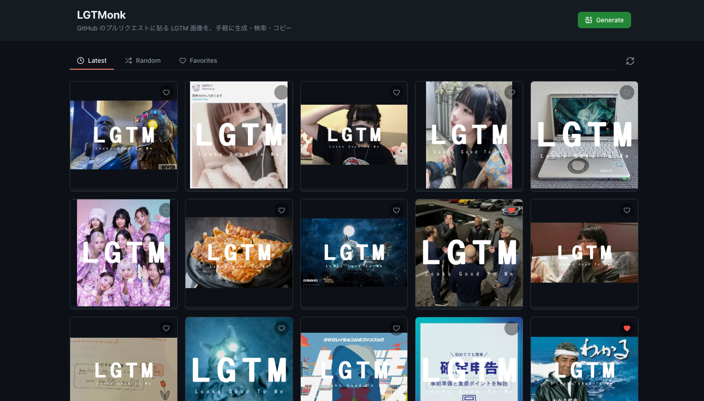
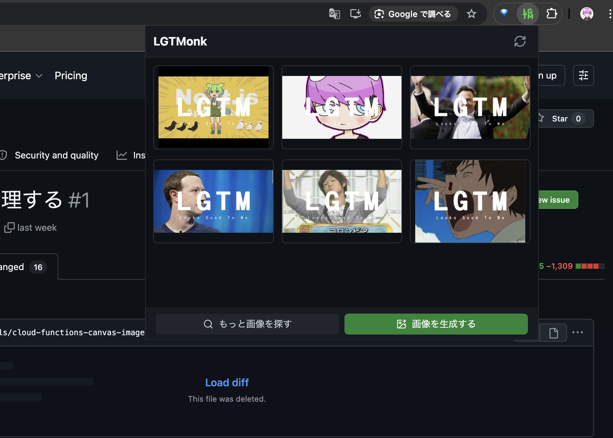

## はじめに

LGTM画像メーカー「LGTMonk」を個人開発しました。コードレビューで使うLGTM画像を手軽に生成・検索・コピーできるWebアプリです。Chrome拡張も開発しており、GitHubのPull Request画面を開いたままワンクリックでLGTM画像を貼り付けることができます。

この記事では、LGTMonkの開発経緯や技術的なこだわりについて書きました。

## LGTMonkとは

LGTMonkは、GitHubのプルリクエストに貼るLGTM画像を生成・検索・コピーできるWebアプリケーションです。LGTMの僧侶（Monk）として、コードレビューをポップに盛り上げる"お坊さん"的存在をコンセプトにしています。



主な機能は以下の通りです。

- **LGTM画像一覧**: ランダム・最新順・お気に入りのタブで画像を表示します
- **ワンクリックコピー**: LGTM画像のMarkdown埋め込み用テキストをコピーできます
- **画像アップロードによる生成**: 好きな画像をアップロードしてLGTM画像を生成できます
- **画像検索からの生成**: キーワードでWeb画像検索し、選んだ画像からLGTM画像を生成することもできます
- **お気に入り機能**: 気に入った画像を保存しておくことができます

Chrome拡張もあります。Pull Requestの画面を開いたまま、拡張のポップアップからランダムなLGTM画像を選んでワンクリックでコピーすることができます。わざわざLGTMonkのサイトを開く必要がないので、コードレビューの流れを止めずにLGTM画像を貼ることができます。



## 作った動機

コードレビューでLGTM画像を貼るのが好きなのですが、既存のLGTM画像ツールにいくつか不満がありました。

- **重い・広告が多い**: 既存ツールはページが重く、広告も多くて使いづらいです。画像の生成も遅く、待たされることが多かったです
- **毎回同じ画像で飽きる**: お気に入りのLGTM画像を何枚かストックしていましたが、毎回同じ画像を貼っていると新鮮味がなくなってきます
- **自分で選んだ画像を使いたい**: テンション感を伝えるために、そのときの気分に合った画像でLGTMしたいときがあります
- **スマホで使いづらい**: スマホのGitHubアプリからコードレビューすることもありますが、既存ツールはPC前提のUIで、スマホからだと操作しにくいと感じていました。

これらの不満を解消するため、広告なし・軽量・レスポンシブ対応のLGTM画像メーカーを自作することにしました。

## 技術スタック

| レイヤー | 技術 |
|----------|------|
| フレームワーク | TanStack Start |
| 言語 | TypeScript |
| スタイリング | Tailwind CSS + shadcn/ui |
| データベース | Firestore |
| オブジェクトストレージ | Cloud Storage for Firebase |
| サーバーサイド | Cloud Functions for Firebase |
| インフラ | Vercel |
| 画像検索 | Brave Search API |
| 画像合成 | napi-rs + sharp |

フレームワークには[TanStack Start](https://tanstack.com/start/latest)を採用しました。TypeScriptでフルスタックに書けるフレームワークで、型安全なルーティングやデータフェッチが魅力です。スタイリングはTailwind CSSとshadcn/uiの組み合わせで、UIの構築速度を重視しました。

画像検索にはBrave Search APIを使用しています。当初はGoogle Custom Search APIを使っていましたが、現在は新規登録を受け付けていないため、Brave Search APIに移行しました。

## こだわったこと

### Firestoreのランダム取得

LGTMonkを開発する上で、一番技術的にこだわったことはランダムタブの実装です。トップページを開くたびに違うLGTM画像が表示されるので、毎回新鮮な気持ちでLGTM画像を選べます。

しかし、Firestoreにはランダム取得のための組み込み機能がありません。単純に`limit`で取得してクライアント側でシャッフルする方法では、常にドキュメントID順で先頭の数件しか候補にならず、コレクション全体からランダムに選ばれているとは言えません。

そこで、`random`フィールドを使ったピボットクエリという手法を採用しました。

#### 仕組み

- 画像をFirestoreに保存するとき、`random`フィールドに0〜1の乱数を付与する
- ランダム取得時に、起点となる乱数（ピボット）をランダムに生成する
- `where("random", ">=", pivot)` と `orderBy("random")` を組み合わせて、ピボット以降のドキュメントを1件取得する
- ピボットがすべてのrandom値を超えた場合は、先頭に戻って再クエリする（ラップアラウンド）
- これを必要な件数分繰り返し、重複があれば再クエリで補完する

```typescript
const fetchOneAfterPivot = async (pivot: number) => {
  const q = query(
    collection(db, 'images'),
    orderBy('random'),
    where('random', '>=', pivot),
    limit(1),
  )
  const snap = await getDocs(q)

  if (!snap.empty) return snap.docs[0]

  // ラップアラウンド: ピボットが末端を超えた場合は先頭から取得
  const q2 = query(
    collection(db, 'images'),
    orderBy('random'),
    limit(1),
  )
  const snap2 = await getDocs(q2)
  return snap2.empty ? null : snap2.docs[0]
}
```

この手法のメリットは、1回のクエリで1件しか読み取らないためコストが低く、`Promise.all`で並列化すればレイテンシも最小限に抑えられることです。コレクション全体から均一にサンプリングされるため、画像が増えても古い画像に偏ることがありません。
詳しくは次のブログ記事で書こうと思います。

Firestoreでのランダム取得は意外と情報が少なく、この仕組みを思いついたときは嬉しかったです。

### Chrome拡張化

既存のLGTM画像ツールは、使うたびにそのアプリのタブを開く必要があり、レビュー中の流れが止まってしまうのが煩わしいと感じていました。Chrome拡張にすることで、GitHubのPull Request画面を開いたまま、ツールバーのアイコンをクリックするだけでLGTM画像を選んでコピーできるようになりました。

Chrome拡張の開発は、Viteの[vite-plugin-web-extension](https://vite-plugin-web-extension.aklinker1.io/)というプラグインを使うことでスムーズに進められました。モノレポ構成で`apps/extension/`として追加し、Webアプリ側の型定義やFirestoreの操作ロジックを共通化していたおかげで、拡張機能側の実装は最小限で済みました。モノレポにしておいてよかったと実感した場面でした。

拡張機能はManifest V3に対応しており、ポップアップを開くとFirestoreからランダムに6枚のLGTM画像を取得して表示します。画像をクリックするとMarkdown形式でクリップボードにコピーされるので、そのままPull Requestのコメント欄にペーストするだけです。

### LGTM画像の生成（napi-rs + sharp）

LGTM画像の生成処理はCloud Functions上で動いています。アップロードされた画像に「LGTM」テキストを合成し、WebP形式でFirebase Storageに保存します。

画像処理にはnapi-rsとsharpを使用しました。sharpは高速な画像処理ライブラリで、リサイズやフォーマット変換を効率的に行えます。napi-rsのcanvasでテキストの描画を行い、sharpで画像の合成とWebP変換を行うという流れです。

WebP形式で配信することで、JPEG/PNGに比べてファイルサイズを抑えつつ画質を維持しています。Cloud Functions上ですべての画像処理を完結させているため、クライアント側の負荷はありません。

この画像合成の仕組みは [【Node.js】つらみを解消しながら動的なOGP画像を生成する](https://zenn.dev/andmohiko/articles/7047b9caa7d471) という記事をベースにしています。過去の個人開発の資産を使い回しました。

## さいごに

LGTMonkを作ったことで、LGTM画像を貼り付ける煩わしさが大幅に減りました。Chrome拡張のおかげでレビュー中の流れを止めずにLGTM画像を貼れるようになり、以前よりもLGTM画像をたくさん貼るようになりました。

Firestoreでランダム取得を実現する方法を考えるのが一番楽しかったです。Firestoreにはランダム取得の機能がないため自分で工夫する必要がありましたが、ピボットクエリという仕組みを思いつけたのはよかったです。

LGTMonkはどなたでも使えるので、ぜひ使ってみてください。
