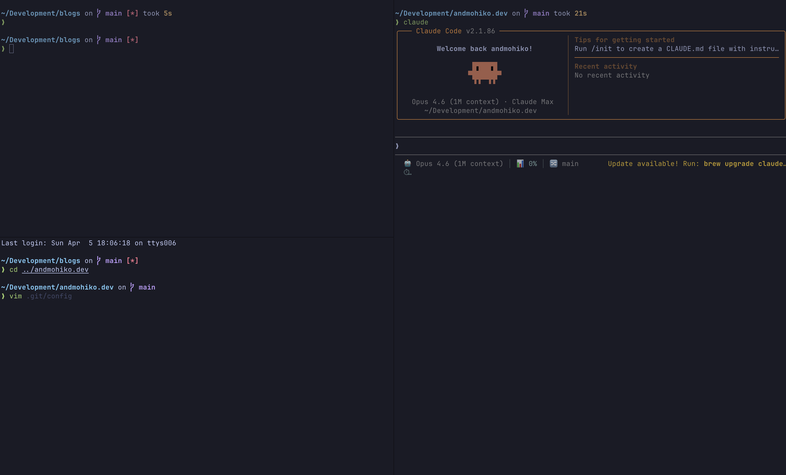
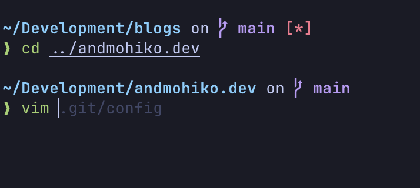
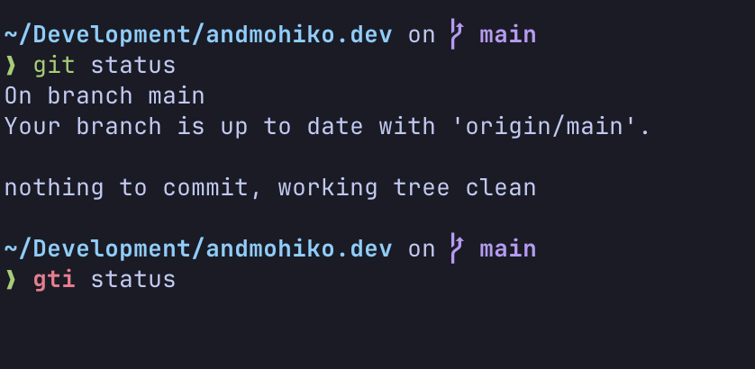

## はじめに

Claude Codeの登場でターミナルを使う時間が増え、ターミナルの構成を見直した方も多いのではないでしょうか。

この記事では、zsh + Ghostty + Starshipという構成でモダンなターミナル環境を構築する手順を紹介します。

今回の設定を行うとこのようなターミナルになります。



## 移行のモチベーション

筆者は今までzsh + iTerm2 + tmuxという構成で長らく開発してきました。iTerm2が重いという話をよく聞きますが、自分はあまり感じていませんでした。zpreztoというプラグインも入れており、使い心地も気に入っていたため、今まで他のターミナルに移行したいと思うことはありませんでした。

しかし、Claude Codeを並列で動かす際に[cmux](https://cmux.com/ja)を使っており、cmuxはGhosttyをベースにしているため、メインで使用するターミナルもGhosttyに揃えたいと思うようになりました。また、現在の構成と同じことがGhosttyでもできることがわかったため、移行を決断しました。

他にも最近人気なターミナルとしてWezTermやWarpをよく聞きますが、cmuxとの相性と、設定の簡単さに惹かれ、Ghosttyを選びました。

## 今回使用するツールの紹介

今回の構成で使用するツールを紹介します。

### zsh

zshはmacOSのデフォルトシェルです。今回の構成ではシェル本体としての役割を担います。zshの設定ファイルである`.zshrc`にプラグインやStarshipの設定を追加していく形になります。

### Ghostty

[Ghostty](https://ghostty.org/)は、Zig言語で書かれており、GPU加速による高速な描画が特徴です。macOSではネイティブのCocoa UIを採用しているため、OSとの統合も良好です。内部実装については [Ghosttyの凄さを 技術的に深ぼってく](https://www.docswell.com/s/fumiya-kume/K2746V-2026-03-27-205311#p1) というスライドでわかりやすく解説されています。複数の言語で書かれていてすごいです。

設定ファイルがシンプルで、`key = value`形式で書くことができます。

### Starship

[Starship](https://starship.rs/ja-jp/)は、Rust製のクロスシェルプロンプトです。現在のディレクトリのGit情報やNode.jsのバージョンなど、開発に役立つ情報をプロンプトに表示してくれます。

oh-my-zshやPowerlevel10kなども有名ですが、Starshipはシェルに依存しない設計で、設定もTOML形式のファイルひとつで完結するのが魅力です。動作も非常に高速です。

### zsh-autosuggestions

[zsh-autosuggestions](https://github.com/zsh-users/zsh-autosuggestions)は、過去のコマンド履歴から補完候補をサジェストしてくれるプラグインです。コマンドを入力し始めると、グレーの文字でサジェストが表示され、右矢印キーで確定できます。Fish shellのような補完体験をzshで実現できます。



### zsh-syntax-highlighting

[zsh-syntax-highlighting](https://github.com/zsh-users/zsh-syntax-highlighting)は、コマンドの構文をリアルタイムでハイライトしてくれるプラグインです。存在するコマンドは緑、存在しないコマンドは赤で表示されるため、Enterを押す前にタイプミスに気づけます。



## 導入手順

ここからは実際のセットアップ手順を紹介します。macOSでHomebrewが導入されている前提で進めます。

### Ghosttyのインストールとセットアップ

HomebrewでGhosttyをインストールします。

```bash
brew install --cask ghostty
```

インストール後、設定ファイルを作成します。Ghosttyの設定ファイルは`~/.config/ghostty/config`に配置します。

```bash
mkdir -p ~/.config/ghostty
touch ~/.config/ghostty/config
```

設定ファイルに以下のように記述します。

```bash
# ~/.config/ghostty/config

theme = TokyoNight Night
background-opacity = 0.8
```

利用可能なテーマやフォントは、以下のコマンドで確認できます。

```bash
# テーマ一覧
ghostty +list-themes

# フォント一覧
ghostty +list-fonts
```

設定を変更した後は、`Cmd + Shift + ,`でリロードできます。ターミナルを再起動する必要はありません。

### zshプラグインのインストール

zsh-autosuggestionsとzsh-syntax-highlightingをHomebrewでインストールします。

```bash
brew install zsh-autosuggestions
brew install zsh-syntax-highlighting
```

インストールしたら、`.zshrc`にsourceの設定を追加します。

```bash
# zsh-autosuggestions
source $(brew --prefix)/share/zsh-autosuggestions/zsh-autosuggestions.zsh

# zsh-syntax-highlighting（.zshrcの末尾に記載する必要があります）
source $(brew --prefix)/share/zsh-syntax-highlighting/zsh-syntax-highlighting.zsh
```

### Starshipのインストールとセットアップ

HomebrewでStarshipをインストールします。

```bash
brew install starship
```

`.zshrc`の末尾（zsh-syntax-highlightingより後）に以下を追加します。

```bash
# Starship
eval "$(starship init zsh)"
```

Starshipの設定ファイルは`~/.config/starship.toml`です。

```bash
touch ~/.config/starship.toml
```

設定ファイルに以下のように記述します。

```toml
# ~/.config/starship.toml

# Get editor completions based on the config schema
"$schema" = 'https://starship.rs/config-schema.json'

add_newline = true

[directory]
truncation_length = 100
truncate_to_repo = false

[username]
disabled = true

[package]
disabled = true

[nodejs]
disabled = true

[gcloud]
disabled = true

[git_status]
ahead = '⇡${count}'
diverged = '⇕⇡${ahead_count}⇣${behind_count}'
behind = '⇣${count}'
untracked = '*'
```

### フォントの設定

Starshipはプロンプトにアイコンを表示するため、[Nerd Font](https://www.nerdfonts.com/)が必要です。Nerd FontはHomebrewでインストールできます。

```bash
# 例: JetBrains Mono Nerd Font
brew install --cask font-jetbrains-mono-nerd-font
```

インストールしたフォントをGhosttyの設定ファイルで指定します。

```bash
# ~/.config/ghostty/config
font-family = JetBrainsMono Nerd Font
```

## さいごに

zsh + Ghostty + Starshipという構成でターミナル環境を構築しました。

移行してみて特に良かったのは、ペイン分割時に分割元のディレクトリのままペインが開かれることです。iTerm2との操作感の違いはほとんど感じていませんが、cmuxの表示がGhosttyと統一され、cmuxを使うときの違和感がなくなりました。

ターミナル環境の構築は一度やってしまえば長く使えるので、気になった方はぜひ試してみてください。他のPCでも同様の設定をしていきたいと思います。

## 参考

- [Ghostty](https://ghostty.org/)
- [Starship](https://starship.rs/ja-jp/)
- [zsh-autosuggestions](https://github.com/zsh-users/zsh-autosuggestions)
- [zsh-syntax-highlighting](https://github.com/zsh-users/zsh-syntax-highlighting)
- [Nerd Fonts](https://www.nerdfonts.com/)
