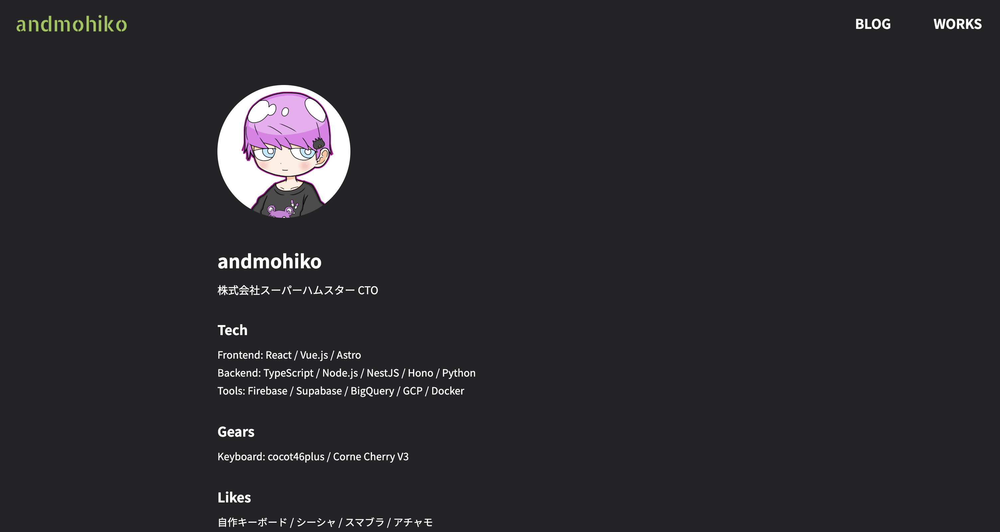
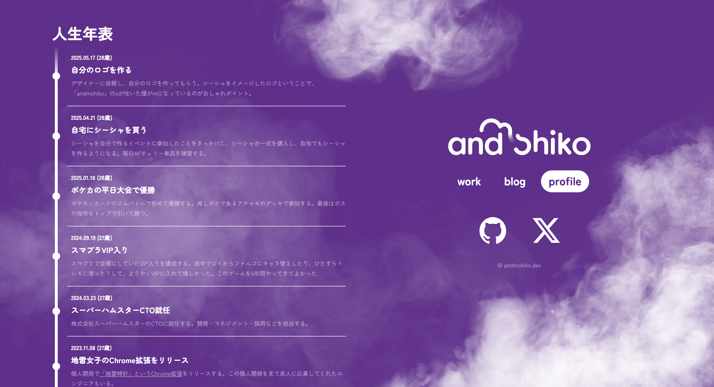

## はじめに

6年間運用していたポートフォリオサイトをリニューアルしました。学生時代から継続的に更新してきたサイトでしたが、今回デザインも作り直し、技術スタックも大幅に変更しました。今回はリニューアルの背景や技術選択について書いてみたいと思います。

## 学生の頃に作ったサイトを6年間更新していた

最初にこのポートフォリオサイトを作ったのは学生時代のことでした。フロントエンドの勉強として、当時はモダンだったNuxt.jsの2系でサイトを構築しました。シンプルなデザインでしたが、初めてサイトを作った達成感がありました。

その後エンジニアとしてキャリアを積む中で、技術的な学習も兼ねてAstroにリプレイスしました。Astroのアイランドアーキテクチャや高速なビルド、必要最小限のJavaScriptという特徴を実際に体験でき、こちらも勉強になりました。

6年間同じサイトを継続的に更新し続けてきました。新しいプロジェクトを追加したり、技術ブログを書いたり、デザインを少しずつ調整したりと、愛情を込めて育てました。

## サイトの内容

リニューアル後のサイトでは、以下のコンテンツを用意しています：

- [ブログ(/blogs)](/blogs)：技術記事やプロジェクトの振り返りなど
- [ポートフォリオ(/)](/)：これまでに取り組んだプロジェクトの詳細
- [About(/profile)](/profile)：自己紹介や現在の取り組みについて
- [人生年表(/profile)](/profile#timeline)：エンジニアとしてのキャリアや重要なマイルストーン

特に人生年表は今回新しく追加したコンテンツで、AIと対話する際に、自分の文脈がインターネット上に公開されている方がAIの回答の精度が上がると思い、追加しました。

## 技術スタック

今回のリニューアルでは、AstroからNext.jsにリプレイスしました。

Astroは開発体験もよく、パフォーマンス面では非常に優秀でした。しかし、新しいデザインでより柔軟なルーティングが必要になったことと、Next.jsの最新機能を学習したかったため、リプレイスすることにしました。

## こだわり

今回のリニューアルで特にこだわったのは、Next.jsの[Parallel Routes](https://nextjs.org/docs/app/api-reference/file-conventions/parallel-routes)と[Intercepting Routes](https://nextjs.org/docs/app/api-reference/file-conventions/intercepting-routes)を活用したユーザー体験の向上とSEO対策です。

Parallel Routesを使うことで、動的なページコンテンツと全ページ共通のナビゲーションを同時に表示できるようになりました。また、Intercepting Routesを活用することで、ユーザーとしてはモーダルを開いているだけという体験のまま、URL的にはページ遷移しているという挙動を実現しました。

これらの機能はNext.js 13のApp Routerで導入された機能で、デザインに合わせたユーザー体験を作り込むことができました。

## さいごに

自分で見返したくなるサイトを作れてうれしいです。

エンジニアとして成長する中で、自分のポートフォリオサイトは技術的な実験場にもなっており、今回のリニューアルで得られた技術的な知見は、今後の業務でも活かしていきたいと思います。
